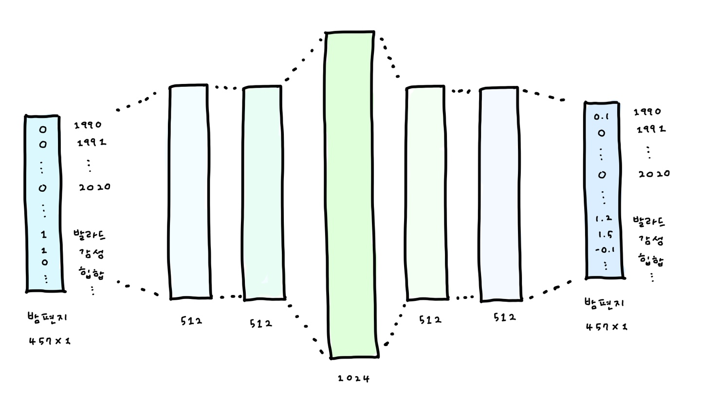
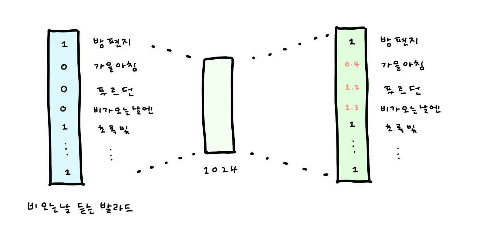
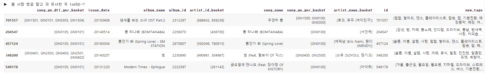
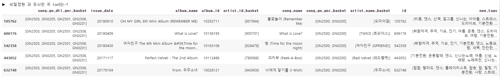
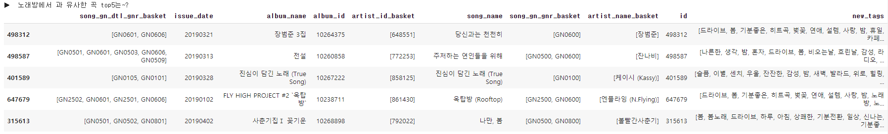

# :musical_note: CB로 sparsity 해결을 시도한 AutoEncoder for CF

```python
# 12.16 수정 결과
Music nDCG: 0.187719
Tag nDCG: 0.387189
Score: 0.217639
```

## Introduction

일반적으로 CB와 CF를 함께 쓴 추천 시스템이라고 한다면 CB로 일부를, CF로 일부를 추천한 후 합쳐서 제시한다.

그러나 CF 모델에 넣기에는 user가 가진 정보가 부족해서 노래를 제대로 추천해주지 못하는 경우가 생겼다.

CB만으로 추천한 모델보다는 CF를 이용한 모델이 점수가 더 높은데, CF는 tag 점수가 너무 약했다. 태그 점수도 올리면서 music nDCG까지 올릴 방법 + sparse함을 해결할 방법 을 생각해보다가 (모델은 바꾸지 않고) **CB를 통해 노래를 추천한 후, 이를 query에 결합하여 CF의 input으로 사용해보자** ! 하는 아이디어가 떠올랐다.

단순히 CB와 CF를 합친 것 보다 좋은 성능을 발휘했다 !


## 1 ) Content-based Recommendation

AutoEncoder를 이용하여 1024차원의 embedding vector를 생성하고 cosine similarity를 이용하여 유사한 노래를 찾는다.



1. 발매 년도, 발매 월, 장르, 고빈도 태그를 이용하여 457차원의 one-hot vector를 생성한다.

2. `457 > 512 > 512 > 1024 > 512 > 512 > 457` 으로 차원을 확장하였다가 줄이는 구조를 가진 AutoEncoder를 이용하여 학습한다.

   > decoder의 가중치는 encoder 가중치를 그대로 이용한다.

   ```python
   non_linearity_type = "relu"
   drop_prob = 0.8
   weight_decay = 0.0001
   lr = 0.0001
   num_epochs = 50
   batch_size = 128
   
   optimizer = optim.Adam()  
   loss = loss1 + loss2*3  where loss1 = nn.MSEloss(inputs, outputs, reduction = 'sum')
   							  loss2 = nn.MSEloss(inputs, outputs, reduction = 'mean')
   ```

3. encoder를 통해 song embedding을 추출한 후 cosine similarity를 계산하여 가장 유사한 노래부터 내림차순으로 정렬하여 저장한다.


## 2 ) Collaborative Filtering



1. 약 27개의 곡을 이용하여 one hot vector를 생성한다.

2. `277,218 > 1024 > 277,218` 구조의 AutoEncoder를 이용하여 학습시킨다.

   > encoder와 decoder 가중치는 독립적으로 학습한다.

   ```python
   non_linearity_type = "selu"
   drop_prob = 0.8
   weight_decay = 0
   lr = 0.2
   num_epochs = 45
   batch_size = 1024
   
   optimizer = SGD , momentum = 0.6
   loss = loss1 + loss2*50  where loss1 = nn.MSEloss(inputs, outputs, reduction = 'sum')
   						 	   loss2 = nn.MSEloss(inputs, outputs, reduction = 'mean')
   ```

   

## Evaluation

> sparse한 validation을 **Content-based recommendation을 통해 약간 더 dense하게 만들어 준 뒤 CF를 진행**합니다.


1. Query를 one hot vector로 만든다.

2. Query에 포함된 모든 곡에 대하여 각 1개 ~ 3개의 유사곡을 찾아 추천한다. `Content_based_recommendation`

3. `Content_based_recommendation`에 속한 곡을 이용하여 **Query vector를 채운다**. `Query*`

   > query에는 정보가 부족한 경우가 많다. **Content based로 추천한 결과를 Query에 더해줌으로써 CF 추천 결과의 성능을 높이고자 하였다.** 3번 과정을 통해 Query 내에 약 100개의 노래가 포함되도록 한다.

4. `Query*`를 AutoEncoder에 넣어 점수를 내림차순 한 후 노래를 추천한다.

5. 추천한 곡들과 가장 많이 매칭된 tag를 찾아 10개를 추천한다.


* 만약 Query에 노래가 없을 경우
  1. tag가 있다면 해당 tag와 많이 매칭된 곡을 찾아 100곡을 추천한다.
  2. tag가 없다면 train set에서 가장 많이 등장한 100곡을 찾아 추천한다.


## Score

```python
Music nDCG: 0.103753
Tag nDCG: 0.302064
Score: 0.133499
```


:raising_hand_woman: **둘 중 하나만을 이용하거나, 단순히 섞기만 해서는 위와 같은 점수를 낼 수 없다.**

Content-based의 결과를 Query vector에 포함해서 CF model에 넣는 방식이 미미하지만 성능 향상에 영향을 끼쳤다고 볼 수 있다.

1. **CF만을 이용해서 추천했을 경우** :  노래는 잘 맞추지만 태그 성능이 좋지 않음.

   ```python
   Music nDCG: 0.0984524
   Tag nDCG: 0.17614
   Score: 0.110106
   ```

2. **CB만을 이용해서 추천했을 경우** :  tag는 잘 맞추지만 노래 점수는 크게 하락함.

   ```python
   Music nDCG: 0.0675142
   Tag nDCG: 0.338713
   Score: 0.108194
   ```

3. **두 방법을 단순히 함께 이용한 경우** : 30곡 이하이면 2곡씩, 30곡 이상이면 1곡씩 CB로 추천, 나머지는 CF로 추천

   * CB로 많이 추천해줄 수록 tag 점수는 올라가지만 노래 점수는 하락함.
   * 노래 점수는 CF만을 쓴 것 이상으로 올라갈 수 없었음.

   ```python
   Music nDCG: 0.0890984
   Tag nDCG: 0.282032
   Score: 0.118038
   ```
  
  

# 3. 결합된 CB,CF와 AutoEncoder를 이용한 유사곡 추천 모델
## Introduction

* 노래 embedding 자체에 user들이 제공한 정보를 포함할 수는 없을까?

* 장르가, 태그가 비슷한 노래 뿐만 아니라 meta 정보는 다를지라도 사용자들이 함께 듣는 노래들을 묶어주면 어떨까?

하는 아이디어에서 출발하였습니다.


[Training Deep AutoEncoders for Collaborative Filtering](https://arxiv.org/pdf/1708.01715.pdf) 에서 아이디어를 얻고, 논문에서 제시한 테크닉 중 일부만을 선택(아래서 자세히 기술)하여 song embedding을 얻고자 하였습니다.


논문의 conclusion에서는 이 모델을 item에 쓰는 것 보다 user에 쓰는 것을 추천하고 있습니다.

생각을 조금 전환하여 **song을 user로, meta 정보와 play list에 대한 정보를 item으로** 생각할 수 있겠다고 판단하였습니다.

만약 song1, song3, song10이 하나의 play list에 있다면, **함께 있는 song들을 "서로 취향이 비슷한 user"**라고 판단합니다.

**song1과 유사한 노래는 song3에게 추천해주어도 좋아할것이다! 라는 가정**을 세웠습니다.

song embedding을 통해 유사한 노래를 찾고, play list에 포함된 노래에서 유사곡을 k곡씩 골라 100곡을 채워 추천합니다.


## Training

**parameters**

```
layer_size = one_hot_encoding.shape[1]
hidden_layers = 24,684 > 2,048 > 1,024 > 2,048 > 24,684
non_linearity_type = "selu"
drop_prob = 0.8
weight_decay = 0.0001
lr = 0.0005
num_epochs = 50
aug_step = 1
batch_size = 2048
```

`RMSE loss: 1.650`


1. 논문에서 제시한대로 **negative part를 없애지 않는 selu**를 activation fuction으로 사용

   * epoch 30에서 relu를 사용한 모델과 비교한 결과 selu를 사용한 모델이 `True > True` 로 더 잘 예측하였음.

   * 예측 값이 0.5 이상일 경우 고득점으로 생각하고 어느정도 정답을 맞추었다고 가정한 후 평가.

     Relu를 사용한 경우에 1을 0 혹은 0.00x로 예측한 경우가 많았음. 1을 0.5 이상으로 맞춘 경우 역시 대부분 sample에서 50%를 넘지 못함.

     그러나 Selu를 사용한 경우에는 1을 0.5 이상으로 예측한 경우가 약 60%정도로 보임. 더 잘 학습되었다고 판단함.

2. Loss function을 수정

   * loss는 **Masked MSE** 이외에 일반적인 MSE를 wieghted sum해서 사용하였음 **(w1 = 15, w2 = 200)**
   * MMSE만 사용할 경우 모든 item을 1로 예측하는 경우가 생김.
     **rating이 0인 item도 적절히 예측하도록 만들기 위해서** MSE를 추가적으로 이용함.
   * 학습 초기에는 MMSE가 더 높으나(즉 학습 초반에는 1을 1로 잘 예측하지 못하고 있음.) 두 loss가 동시에 낮아지면서 차이가 미미해짐. 1을 맞추면서도 0을 모두 1로 예측하지 않도록 균형을 잡으며 학습할 것으로 기대하였음.

3. Re feeding을 하지 않았음.

   * Re feeding을 하는 가정은 <u>잘 학습된 AE의 경우 `AE(x*) = AE(x)`를 만족해야 한다</u>임.

     > 자세한 내용은 논문, 혹은 [리뷰 참고](https://hhhaeuuu.tistory.com/119)

   * 그러나 **song을 user로 보게 된다면 이를 만족하지 않아야 한다**고 생각하였음. 

   * 같은 장르, 같은 태그를 가졌다고 할지라도 어떤 play list에 담겨있는가를 통해 다른 embedding을 가져야 하는 것이 더 좋은 모델이라고 판단


## 유사곡 추출

cosine similarity를 이용하여 자기 자신을 제외한 유사곡을 100곡씩 추출하여 저장


**아이유의 봄 사랑 벚꽃 말고와 유사한 곡 top5**




**오마이걸의 비밀정원과 유사한 곡 top5**




**장범준의 노래방에서와 유사한 곡 top5**



## Evaluation

1. 노래가 없는 경우

   1. 태그가 있다면, 각 태그별로 가장 많이 매칭된 노래를 `tag_to_sid`에서 뽑아 채운다.
      추천된 노래를 기반으로 tag를 추출한다. 
      각 노래가 tag에 투표하고, 가장 많은 표를 받은 tag부터 top10을 선정한다. 노래가 tag에 투표하는 기준은 *해당 tag가 달린적이 있다/없다* 이다.

   1. 태그가 없다면, 가장 인기있는 노래`pop_songs`와 태그 `pop_tags`로 채운다.

2. 노래가 1곡 이상 있는 경우

   k곡씩 유사곡을 골라 100곡을 채우고, 추천된 노래를 기반으로 tag를 추출한다.
   ex ) 노래가 3곡 포함되어있다면, `[34,33,33]` 곡씩 유사곡을 추출한다.


## Score

세 개의 모델 중 가장 우수한 성능을 보여주었다 !

```python
Music nDCG: 0.107791
Tag nDCG: 0.338882
Score: 0.142455
```

